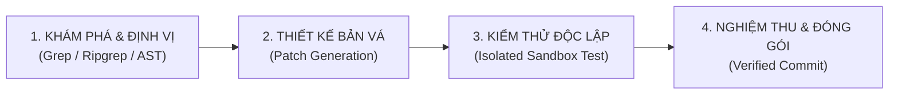

# Kỹ Năng Lập Trình & Bảo Trì Mã Nguồn Chuẩn DeepSWE

Kỹ năng này hiện thực hóa quy trình vận hành của tác tử lập trình **DeepSWE v1.1** (đạt 59% SWE-bench Verified) vào hệ sinh thái beFAMILY OS và các dự án phần mềm của beONE.

## 1. Khi nào nên dùng
- Khi cần tìm và sửa lỗi (Bug fix), refactor mã nguồn hoặc xây dựng tính năng mới trong codebase.
- Khi cần tự động hóa việc viết Unit Test và chạy kiểm thử độc lập trong môi trường cách ly trước khi đưa vào sản xuất.
- Khi cần rà soát mã nguồn (Code Review) và phát hiện lỗ hổng bảo mật nội bộ.

## 2. Quy trình 4 bước vận hành chuẩn DeepSWE

### Bước 1: Khám phá & Định vị (Locate)
- Sử dụng các công cụ tìm kiếm tĩnh (`grep_search`, `find_by_name`) để quét toàn bộ các điểm xuất hiện của lỗi.
- Đọc hiểu ngữ cảnh xung quanh dòng lỗi (tối thiểu 10 dòng trước và sau).
- Tuyệt đối không sửa code khi chưa định vị được nguyên nhân gốc rễ (Root Cause).

### Bước 2: Thiết kế bản vá tối thiểu (Minimal Patch)
- Áp dụng nguyên lý Lean: Chỉ sửa đúng khối code bị lỗi, bảo toàn nguyên vẹn cấu trúc và chú thích hiện hữu.
- Không viết lại toàn bộ file nếu chỉ cần thay thế một đoạn ngắn.

### Bước 3: Kiểm thử độc lập (Isolated Unit Test)
- Viết hoặc chạy kịch bản kiểm thử tự động tương ứng với lỗi vừa sửa.
- Chạy lệnh kiểm tra trong shell để xác nhận lỗi đã được khắc phục và không phát sinh lỗi hồi quy (Regression).

### Bước 4: Nghiệm thu & Ghi log (Verified Commit)
- Cập nhật tài liệu kỹ thuật và ghi nhận mã lỗi vào nhật ký vận hành.
- Báo cáo kết quả định lượng cho người dùng trước khi đóng tác vụ.
